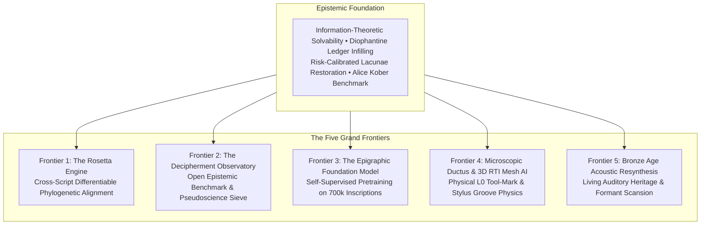

# Blue Sky Research Frontiers: Ancient Text Lab

This document defines experimental research frontiers for `ancient-text-lab` and its affiliated sibling projects (`linear-a`, `phaistos-disk`). Content below is aspirational / exploratory — not a claim that implementations are production-grade or scientifically settled.

---

## Frontier 1: The Rosetta Engine (Cross-Script Phylogenetic Alignment)

### Premise
Ancient Mediterranean and Near Eastern writing systems did not emerge ex nihilo. They evolved as a dynamic transmission network across trade routes:
$$\text{Cretan Hieroglyphic} \longrightarrow \text{Linear A} \longrightarrow \begin{cases} \text{Linear B (Mycenaean Greek, Solved 1952)} \\ \text{Cypro-Minoan (CM1–3)} \longrightarrow \text{Cypriot Syllabic (Arcadocypriot Greek, Solved 1870s)} \end{cases}$$

### Objective
Build a **Differentiable Cross-Script Phylogenetic Graph Engine**. Instead of analyzing Linear A, Cypro-Minoan, or Cretan Hieroglyphs as isolated cyphers, we formulate cross-script correspondence as a joint graph optimization problem:
1. **Palaeographic Ductus Evolution**: Vector Bezier stroke morphing between sign homologues (e.g. tracking cursive stroke reduction between Hieroglyphic and Linear signs).
2. **Phonotactic Transition Graph**: Preserving bigram and trigram transition topologies across sister scripts.
3. **Dual Ground-Truth Anchors**: Anchoring the optimization simultaneously on both solved historical endpoints: **Linear B** (Mycenaean Greek) and **Classical Cypriot Syllabic** (Arcadocypriot Greek).

---

## Frontier 2: The Decipherment Observatory (The Open Verification Web Platform)

### Premise
For over a century, computational archaeology has been inundated with amateur and AI-hallucinated "decipherments" claiming unread scripts are Basque, Semitic, Slavic, or Luwian. Peer review is overwhelmed and unable to respond in real time.

### Objective
Deploy an open-source, automated benchmarking web observatory powered by `ancient-text-lab`:
1. **Shannon Unicity Verification**: Does the candidate mapping violate information theory ($N < U$)?
2. **100,000-Iteration Monte Carlo Sieve**: Does the proposed grammar achieve statistical significance above null permutations ($p < 10^{-5}$)?
3. **Masked Synthetic Lacunae Scoring**: Can the model reconstruct held-out damaged tablets with positive risk-calibrated scores without hallucinating?
4. **Epistemic Certification**: Produces automated, tamper-proof audit certificates for any proposed decipherment.

---

## Frontier 3: The Epigraphic Foundation Model (Pretrained on 700k Inscriptions)

### Premise
The ancient Mediterranean possesses over **700,000 digitized inscriptions** with known readings:
- Latin Epigraphy (EDR / EDCS): 500,000+ texts
- Greek Epigraphy (Packard Humanities Institute): 200,000+ texts
- Linear B (DĀMOS): 5,000+ tablets
- Phoenician & Punic (CIS / KAI): thousands of stelae

### Objective
Pretrain a self-supervised transformer/graph neural network on this vast epigraphic corpus to learn universal domain priors: administrative balance-sheet structures, votive dedicatory cadences, regional scribal ductus variance, and phonological sound changes across time. Apply the frozen representations to undeciphered scripts strictly regulated by our entropy-gated abstention thresholds.

---

## Frontier 4: Microscopic Ductus & 3D Mesh AI ($L_0$ Physical Layer)

### Premise
Fractures on clay tablets and weathered stone stelae are rarely empty voids. Under microscopic photogrammetry (RTI — Reflectance Transformation Imaging) and structured light 3D scanning, fracture edges preserve microscopic stylus entry angles, stroke depths, and burrs.

### Objective
Combine computer vision with kinematic physics to analyze 3D micro-topography meshes of broken tablet edges. Intersect physical stroke remnants with signary vector ductus graphs to reduce unknown broken signs from 90 possibilities down to 2–3 physical candidates before textual inference begins.

---

## Frontier 5: Living Acoustic & Liturgical Heritage Resynthesis

### Premise
Ancient writing was not designed for silent reading in databases; it was oral poetry, hymnody, sacred ritual, and vocal proclamation.

### Objective
Scale the client-side Klatt formant synthesizer and moraic prosody engine developed in `linear-a` and `phaistos-disk` into an open-access Bronze Age Auditory Archive. Allow humanity to hear scientifically accurate acoustic reconstructions of ancient texts, with every phoneme strictly tagged by its evidence tier (E0–E4).

---

## Frontier 6: Causal Reconstruction of the Late Bronze Age Collapse (~1200 BCE)

### Premise
For centuries, the catastrophic unraveling of the Eastern Mediterranean civilizational system circa 1200 BCE (the fall of Mycenae, Hattusa, Ugarit, and the crisis of Egypt) has been reduced to simplistic monocausal scapegoating: "The Sea Peoples destroyed everything." In reality, this was a coupled, multi-decade polycrisis of interconnected complex systems.

### Objective
Build a **Structural Causal Model (SCM) and Dynamic Stress Propagation Simulator**:
1. **Coupled Evidence Layers**: Unify high-resolution palaeoclimate data (speleothem and pollen-core megadrought signals from Soreq Cave and Lake Kinneret), commodity flow severance (Cornwall/Afghan tin + Cypriot copper bottlenecks), internal palace over-extraction, epidemic records (Hittite royal plague tablets), and earthquake storm catalogues.
2. **Counterfactual Simulation ($do(X)$ Interventions)**: Test causal dependencies: e.g., if Egyptian grain aid to Ugarit had not been halted by famine at Merneptah's court, would the northern Levant defense grid have held?

---

## Frontier 7: Philological Fragment Reconstruction Engine (The Lost Classics Lattice)

### Premise
Over 95% of ancient literature is physically lost, yet tens of thousands of lost texts survive as disjecta membra: verbatim quotations in later authors (Athenaeus, Stobaeus, Eusebius), marginal scholia, summaries (Proclus's *Chrestomathy* for the Epic Cycle), and damaged papyrological cartonnage.

### Objective
Construct a **Probabilistic Text-Lattice Generator for Lost Works**:
1. **Multi-Tier Fragment Ingestion**: Strictly separate verbatim quotations ($L_0$), paraphrases ($L_1$), summaries ($L_2$), and hypothetical bridges ($L_3$).
2. **Structural Topology Reconstruction**: Place fragments into book, act, and episode graphs based on metrical constraints, stylistic fingerprints, and citation sequences to generate the most probable architectural skeleton of lost masterpieces.

---

## Frontier 8: Ancient Macro-Network Topology Reconstruction (1500–1100 BCE)

### Premise
Historical macro-economies cannot be understood from texts alone. Bronze Age globalization was anchored in material supply chains whose physical traces survive across the earth.

### Objective
Build a **Multimodal Historical Intelligence Hypergraph (Palantir for Ancient Macro-History)**:
1. **Independent Archaeological Evidence Layers**:
   - **Lead Isotope Analysis**: Tracing copper and lead oxhide ingots to specific geological mines (Lavrion, Troodos, Taurus).
   - **Ceramic Petrography & INAA**: Tracing Mycenaean LH IIIB stirrup jars and Canaanite amphorae trade routes across the Nile Delta and the Levant.
   - **Shipwreck Cargo Matrix**: Fusing primary wreck assemblages (Uluburun, Cape Gelidonya, Point Iria) as ground-truth maritime transit snapshots.
   - **Epigraphic Correspondence**: Spatializing the Amarna Letters and Linear B toponym inventories (e.g. Kom el-Hettan Aegean list).
   - **Oceanographic & Meteorological Routing**: Constraining navigable routes by seasonal winds (Etesian winds) and counter-clockwise Mediterranean currents.
2. **Critical Infrastructure Bottleneck Discovery**: Identify single points of systemic failure in the ancient world.
